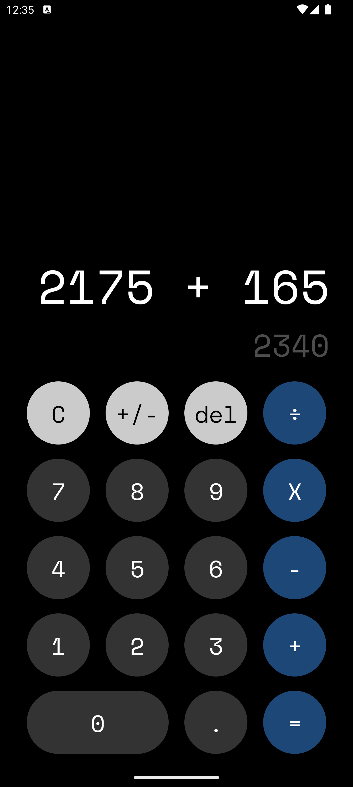

# Calculator App

**Calculator App** Simple calculator created with react native and expo.

## Installation

To get started with the Calculator App, follow these steps:

1. Clone the repository:
   ```bash
   git clone https://github.com/sLiMFly/Calculator-app.git
   ```
2. Navigate to the project directory:
   ```bash
   cd calculator-app
   ```
3. Install the dependencies:
   ```bash
   npm install
   ```
4. Run the app:
   ```bash
   npm start
   ```

## Usage

Once opened, you can press "a" key to open in virtual device Android, press "i" for iOS, press "w" to view on the web, or scan the QR code on a physical device.

## Screenshots

<p align="center">
    
</p>


Ejercicio del curso de [Fernando Herrera](https://fernando-herrera.com/)
